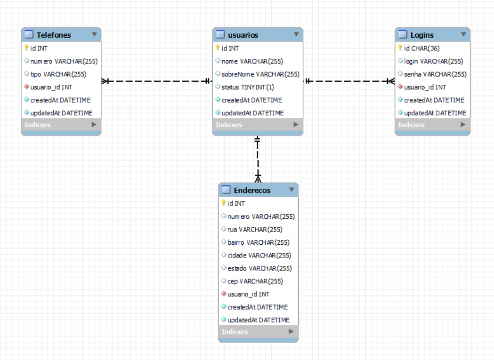
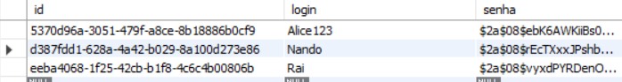

# Guia de Configuração do Projeto com Sequelize e Node.js



## Visão Geral do Projeto

Este projeto foi desenvolvido com o objetivo de treinar e demonstrar minhas habilidades no **backend** utilizando **Node.js** com **Express**, além de utilizar **Sequelize** para o gerenciamento de um banco de dados **MySQL**. O foco principal deste projeto é a criação de uma aplicação robusta que envolva a manipulação de dados no banco e a integração com um sistema backend eficiente.

O projeto abrange as seguintes tecnologias:

- **Banco de Dados**: MySQL
- **ORM**: Sequelize
- **Backend**: Node.js (Express)
- **Frontend**: React.js com TailwindCSS

Além disso, o projeto implementa **criptografia de senhas** para garantir a segurança dos dados sensíveis no banco de dados. A senha é armazenada de forma segura utilizando **bcryptjs**, garantindo que, mesmo em caso de acesso indevido ao banco, as senhas não possam ser lidas diretamente.

### Exemplo de Banco de Dados com Senha Criptografada

O projeto implementa a criptografia de senhas utilizando a biblioteca **bcryptjs**. Ao registrar um usuário, a senha é criptografada antes de ser armazenada no banco de dados. Aqui está um exemplo de como a senha é armazenada de forma segura:

![Imagem da Criptografia da Senha no Banco de Dados]

Esse método garante que, mesmo se alguém acessar o banco de dados, as senhas estarão em formato criptografado e não poderão ser lidas diretamente.
 e Node.js


## Parte 1: Configuração do Sequelize

### 1. Instalar as dependências necessárias:
```bash
npm install sequelize
npm install mysql2
```

### 2. Instalar o `sequelize-cli`:
- Instalar globalmente:
  ```bash
  npm install -g sequelize-cli
  ```
- Instalar localmente (dentro do projeto):
  ```bash
  npm install sequelize-cli --save-dev
  ```

### 3. Inicializar o Sequelize no projeto:
```bash
npx sequelize-cli init
```

### 4. Criar um modelo e migração:
```bash
npx sequelize-cli model:generate --name Usuario --attributes nome:string,sobreNome:string,status:boolean,login_id:integer
```

### 5. Executar a migração:
```bash
npx sequelize-cli db:migrate
```

### 6. Popular o banco com seeders (opcional):
- Gerar um seeder:
  ```bash
  npx sequelize-cli seed:generate --name usuario-seeder
  ```
- Executar os seeders:
  ```bash
  npx sequelize-cli db:seed:all
  ```

### 7. Atualizar comandos do `sequelize-cli`:
O `sequelize-cli` precisa saber que agora o arquivo de configuração mudou de `.json` para `.js`. Adicione o parâmetro `--config` ao rodar os comandos:
```bash
npx sequelize-cli db:migrate --config config/config.js
```

### 8. Reverter as migrações:
- Reverter todas as migrações:
  ```bash
  npx sequelize-cli db:migrate:undo:all
  ```

---

## Parte 2: Instalação de Dependências do Node.js

### 1. Inicializar o projeto Node.js:
```bash
npm init -y
```

### 2. Instalar o Express:
```bash
npm install express
```

### 3. Instalar o CORS:
```bash
npm install cors
```

### 4. Instalar o pacote dotenv:
```bash
npm install dotenv
```

### 5. Instalar o Nodemon:
```bash
npm install nodemon
```

### 6. Instalar o bcryptjs:
```bash
npm install bcryptjs
```

### 7. Instalar o UUID:
```bash
npm install uuid
```

### 8. Instalar o jsonwebtoken:
```bash
npm install jsonwebtoken
# System-login
# System-login


